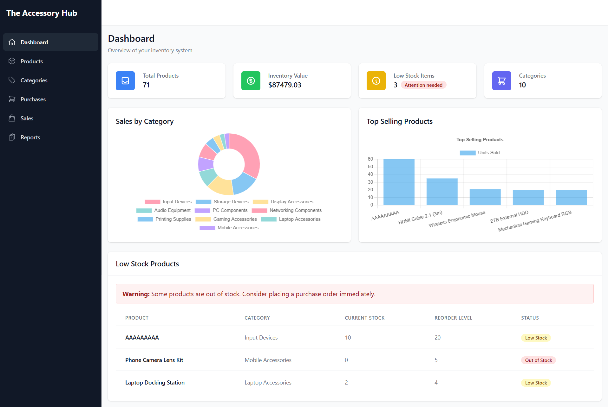
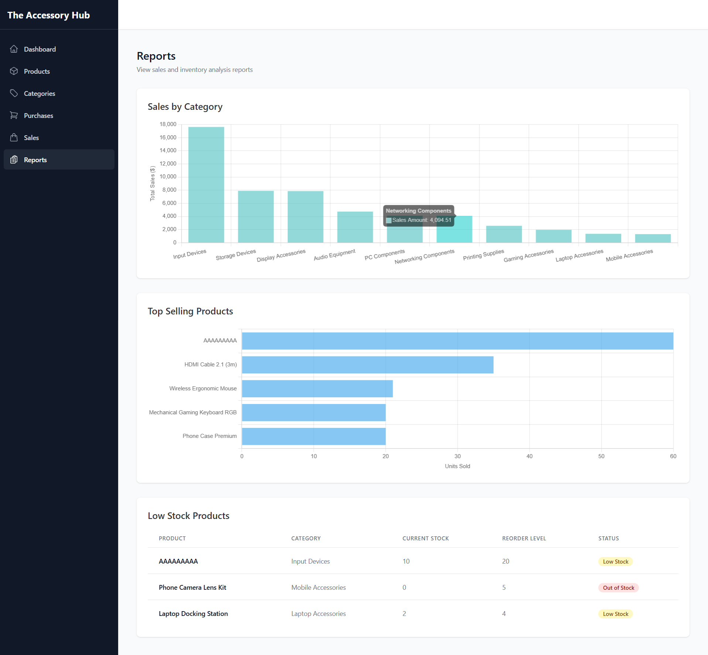

# 🚀 Inventory Management System

A **modern, full-featured inventory management system** for businesses of any size. Track products, manage stock, and gain actionable insights with a beautiful dashboard.  
**Built with Flask (API) & React 19 (Frontend).**

---

## ✨ Features

- **Real-time Inventory Tracking**  
  Instantly see your stock levels and product movements.
- **Product & Category Management**  
  Add, update, and organize products by categories.
- **Purchase & Sales Management**  
  Record transactions, monitor revenue, and analyze trends.
- **Low Stock Alerts**  
  Get notified when inventory runs low.
- **Business Intelligence Dashboard**  
  Visualize sales analytics, top-selling products, and inventory stats.
- **Responsive, Modern UI**  
  Works seamlessly on desktop, tablet, and mobile.

---

## 🖼️ User Interfaces

| Dashboard | 
|-----------|
|  |

|  Reports  |
|-----------|
|  |

---

## 🛠️ Technology Stack

**Backend**
- 🐍 Python Flask (RESTful API)
- 🗄️ SQL Server (Data Storage)
- 🔗 pyodbc (DB Connectivity)
- 🌐 Flask-CORS (CORS Support)

**Frontend**
- ⚛️ React 19 (UI Library)
- 🛣️ React Router 7 (Routing)
- 📊 Chart.js + React-Chartjs-2 (Visualization)
- 🔥 Axios (API Requests)
- 🎨 Tailwind CSS (Styling)
- ⚡ Vite (Dev Server & Build)
- 🦸 HeroIcons (Icons)

---

## 🏗️ System Architecture

```
Backend (Flask API)    Frontend (React)
        |                          |
  SQL Server DB              REST API Calls
```

### Backend Structure
- **controllers/**: API endpoints
- **models/**: ORM/data models
- **services/**: Business logic
- **utils/**: Helpers/utilities
- **database/**: SQL scripts (schema, procs, seed)

### Frontend Structure
- **api/**: Axios configs & endpoints
- **components/**: Reusable UI
- **hooks/**: Custom React hooks
- **layouts/**: Layouts (Sidebar, etc.)
- **pages/**: Top-level pages
- **utils/**: Helpers & formatters

---

## ⚡ Quick Start

### 1️⃣ Database Setup

1. **Create DB:**  
   Create a database named `inventory_management` in SQL Server.
2. **Run Scripts:**  
   Execute the following in order:
   - `database/schema.sql`
   - `database/functions.sql`
   - `database/procedures.sql`
   - `database/triggers.sql`
   - `database/views.sql`
   - `database/seed_data.sql`

   **Using PowerShell:**
   ```
   sqlcmd -S your_server_name -d inventory_management -i database/schema.sql
   sqlcmd -S your_server_name -d inventory_management -i database/functions.sql
   sqlcmd -S your_server_name -d inventory_management -i database/procedures.sql
   sqlcmd -S your_server_name -d inventory_management -i database/triggers.sql
   sqlcmd -S your_server_name -d inventory_management -i database/views.sql
   sqlcmd -S your_server_name -d inventory_management -i database/seed_data.sql
   ```

---

### 2️⃣ Backend Setup

```
cd backend
python -m venv venv
.\venv\Scripts\activate
pip install -r requirements.txt
```

Create a `.env` file:
```
DB_SERVER=your_server_name
DB_USER=your_username
DB_PASSWORD=your_password
DB_NAME=inventory_management
DB_DRIVER=SQL Server
DB_TRUSTED_CONNECTION=yes
DEBUG=True
```

Run the Flask app:
```
python app.py
```
API runs at: [http://localhost:5000](http://localhost:5000)

---

### 3️⃣ Frontend Setup

```
cd frontend
npm install
npm run dev
```
App runs at: [http://localhost:5173](http://localhost:5173)

---

## 📚 API Reference


Products

| Endpoint                           | Method | Description                        |
| ----------------------------------- | ------ | ---------------------------------- |
| `/api/products`                    | GET    | Get all products                   |
| `/api/products/{id}`               | GET    | Get product by ID                  |
| `/api/products`                    | POST   | Create a new product               |
| `/api/products/{id}`               | PUT    | Update a product                   |
| `/api/products/{id}`               | DELETE | Delete a product                   |
| `/api/products/low-stock`          | GET    | Get products with low stock        |
| `/api/products/top-selling`        | GET    | Get top selling products           |
| `/api/products/inventory-summary`  | GET    | Get inventory summary              |


Categories

| Endpoint                           | Method | Description                        |
| ----------------------------------- | ------ | ---------------------------------- |
| `/api/categories`                  | GET    | Get all categories                 |
| `/api/categories/{id}`             | GET    | Get category by ID                 |
| `/api/categories`                  | POST   | Create a new category              |
| `/api/categories/{id}`             | PUT    | Update a category                  |
| `/api/categories/{id}`             | DELETE | Delete a category                  |
| `/api/categories/{id}/products`    | GET    | Get products in a category         |


Purchases

| Endpoint                           | Method | Description                        |
| ----------------------------------- | ------ | ---------------------------------- |
| `/api/purchases`                   | GET    | Get all purchases                  |
| `/api/purchases/{id}`              | GET    | Get purchase by ID                 |
| `/api/purchases`                   | POST   | Create a new purchase              |
| `/api/purchases/product/{id}`      | GET    | Get purchases for a product        |
| `/api/purchases/recent`            | GET    | Get recent purchases               |


Sales

| Endpoint                           | Method | Description                        |
| ----------------------------------- | ------ | ---------------------------------- |
| `/api/sales`                       | GET    | Get all sales                      |
| `/api/sales/{id}`                  | GET    | Get sale by ID                     |
| `/api/sales`                       | POST   | Create a new sale                  |
| `/api/sales/product/{id}`          | GET    | Get sales for a product            |
| `/api/sales/recent`                | GET    | Get recent sales                   |


Dashboard

| Endpoint                           | Method | Description                        |
| ----------------------------------- | ------ | ---------------------------------- |
| `/api/dashboard/overview`          | GET    | Get dashboard overview data        |


